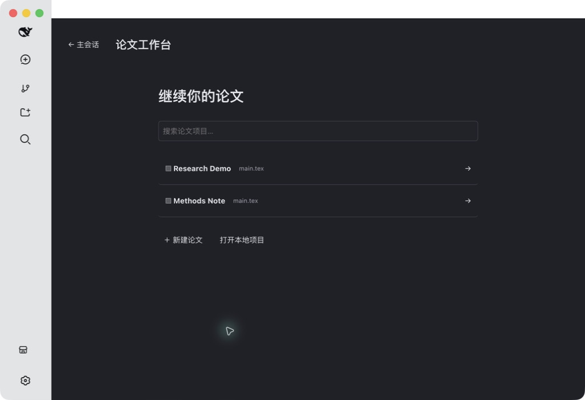

# DSH LaTeX Studio 验收报告

日期：2026-09-19。版本：0.1.0。环境：macOS、DSH Desktop 2.0.10、DeepSeek Harness 0.1.5-rc.2、Node.js 24.11.1、本地 MacTeX。

## 结论

本地论文编辑、真实编译与 PDF 预览、审阅选择、原生模型会话、Agent 文件修改、四级行文导图及增量更新的主要流程已在实际 Desktop 界面运行。17 项自动测试全部通过，构建和发布内容扫描通过。此结果对应上述固定环境，完整跨平台兼容性和极端故障恢复尚未验收。

测试数据为合成的 Research Demo、Methods Note 和临时目录论文。模型调用采用 Desktop 当前配置的真实 deepseek-flash 路由；自动测试中的固定语义响应只用于验证协议与缓存，不作为模型质量证据。

## 自动测试

运行 `npm test`，结果见 [原始测试输出](test-output.txt)。

| 序号 | 测试 | 结果 |
|---|---|---|
| 1 | 项目持久化、重复目录导入复用 | 通过 |
| 2 | 外部文件变化后拒绝覆盖 | 通过 |
| 3 | 行内文件创建、重复名称、路径越界、符号链接 | 通过 |
| 4 | 会话绑定与最近会话持久化 | 通过 |
| 5 | 语义注释与未变段落复用、最近章节定位 | 通过 |
| 6 | 真实编译生成 PDF；语法错误保留上次成功 PDF | 通过 |
| 7 | 子进程取消、超时、缺少可执行文件 | 通过 |
| 8 | 缩写、行内公式、注释及公式环境保护 | 通过 |
| 9 | 缺少模型语义时拒绝生成 | 通过 |
| 10 | 子目录主文件真实编译 | 通过 |
| 11 | 多文件引用、继承章节上下文与循环引用拒绝 | 通过 |
| 12 | 合并导图保持文件位置与同名章节归属 | 通过 |
| 13 | Host API 错误与会话工作目录隔离 | 通过 |
| 14 | 审阅引用限定绑定会话 | 通过 |
| 15 | 公共项目响应隐藏内部语义快照 | 通过 |
| 16 | 多文件分析写回；第二次分析复用全部段落 | 通过 |
| 17 | 注释前后真实编译 PDF 提取正文一致 | 通过 |

## Desktop 行为验收

| 计划项 | 实际操作与证据 | 结论 |
|---|---|---|
| P01 | 新建两篇论文，第二篇初始无审阅和 PDF；切回第一篇恢复原文件与两条审阅 | 通过 |
| P02 | 重复导入通过自动测试；已有目录导入入口已实现 | UI 导入未单独遍历 |
| P03 | 非法路径和符号链接由自动测试覆盖 | 无权限目录未实测 |
| P04 | 多次退出并重启 Desktop，再打开原论文，文件、审阅、PDF、原生会话仍存在 | 通过 |
| F01 | 文件栏加号后直接输入 notes.tex，Enter 创建 | 通过；Esc 分支已实现，未录屏单测 |
| F02/F03 | 重复与嵌套创建、越界、链接拒绝由自动测试覆盖 | 通过 |
| F04 | 同时打开 main.tex 和 notes.tex，保存后关闭 notes.tex，恢复 main.tex | 通过；其他关闭排列未穷举 |
| F05 | 编辑 notes.tex 并快捷键保存；重启恢复已有文件 | 通过；崩溃时草稿恢复未注入故障 |
| F06 | Agent 修改摘要后编辑器读取更新；CAS 自动测试保留外部版本 | 通过 |
| C01 | 点击编译出现真实 PDF 页面；125% 放大和适合宽度有效；已有 PDF 在重启后再次渲染 | 通过；系统下载目录写入未单独验收 |
| C02 | 语法错误和缺少可执行文件由自动测试覆盖 | 通过；缺包组合未穷举 |
| C03 | 取消、超时子进程测试通过；运行期间编译按钮禁用 | 通过；UI 高频连击压力未执行 |
| C04 | 子目录主文件真实编译；多文件解析和模型协议由自动测试覆盖 | 通过；复杂多文件模板未实测 |
| C05 | 编译状态带源码哈希检查，项目结果按项目 ID 归属 | 代码复核；并发 UI 压力未执行 |
| R01 | 键盘选择文字，近旁出现润色、缩减、评论 | 通过；鼠标拖选自动化未获得稳定选区，不能据此声称通过 |
| R02 | 添加两条独立评论；导图定位选区可评论；列表保留原文与意见 | 通过；解决状态排列未全部验收 |
| R03 | 全选得到 2 条，取消单条后计数 1 且全选框为半选 | 通过 |
| R04 | 选中条目追加到原有会话；再点单条箭头，原草稿仍保留；发送按钮等待用户操作 | 通过 |
| R05 | 原文唯一匹配重新定位，无法匹配时报错；分析更新会标记失效锚点 | 代码复核，重复引用 UI 未实测 |
| A01 | 原生模型返回“论文会话已连接” | 通过 |
| A02 | 原生 Agent 使用文件工具将摘要改为指定演示句；编辑器显示新内容 | 通过；本次权限模式无需弹出额外审批，拒绝审批分支未测试 |
| A03 | 聊天抽屉收起后继续编辑；重新打开同一会话，草稿仍在 | 通过 |
| A04 | 多次加入审阅均使用同一论文会话 | 通过；显式新建多会话切换未穷举 |
| M01/M02 | 真实模型生成标题→章节→段落意图→句子意图，Abstract/Introduction 等正确归属 | 通过 |
| M03 | 摘要改变后真实模型更新：analyzed=1、changed=1、reused=5；其余段落复用；最终版本未修改再更新为 analyzed=0、reused=6 | 通过 |
| M04 | 模型返回结构有覆盖与长度校验；任务支持中止 | 格式验证代码复核，真实模型断网与超时未注入 |
| M05 | 行内公式、缩写、注释及受保护环境有回归覆盖，注释前后 PDF 文本相同 | 支持常规正文；复杂宏/混合语言分句仍有边界 |
| M06 | 展开/收起 Introduction；点击段落节点跳到对应源码并选中 | 通过；大图平移压力未执行 |
| V01 | 浅色、深色源码与导图截图复核；原生聊天抽屉适配工作台主题 | 见截图；系统自动切换事件未强制触发 |
| V02 | 1024×700 窗口实际操作，抽屉覆盖右侧而保持源码宽度 | 通过；超窄窗口与长文本极值未穷举 |
| V03 | 多次工作台与聊天抽屉开关、Desktop 重启 | 通过；长时内存泄漏测试未执行 |
| S01 | 扫描源码、锁文件、构建产物；人工检查发布截图与 GIF | 通过，见隐私范围 |
| S02 | 插件注册、重启与原生会话恢复实测 | 通过；插件卸载未在用户 profile 中执行 |

## 界面证据

项目选择：

源码与真实 PDF：

审阅列表与深色源码：

真实模型生成的行文导图：

原生 Agent 对话抽屉：

## 隐私范围

公开内容仅包含插件源码、依赖锁文件、构建产物、文档及合成论文截图。模型凭据、Desktop 设置、原有会话、论文目录和备份不纳入 Git 仓库。源码扫描检查常见 token、私钥与个人绝对路径；截图和 GIF 逐帧查看。自动扫描并非对任意格式敏感信息的形式化证明。

插件普通编辑和编译在本机进行。点击模型分析或发送聊天消息时，相应内容会交给用户当前配置的模型服务。验收截图不包含模型配置、访问密钥和无关工作区列表。

## 后续验收边界

Windows/Linux、不同 TeX 发行版、动态宏引用、长篇多文件论文、外部编辑器并发竞争、磁盘满、进程崩溃及网络故障注入尚需专门测试。多文件保存不是文件系统级整体事务；分析前原文备份保存在本机。首版按已列明的本地常规论文范围交付，不将未执行项标记为通过。
